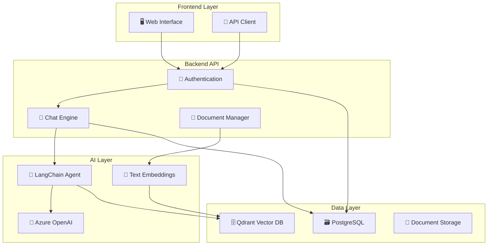

<div align="center">

# 🤖 AI Documentation Agent Backend

### *Intelligent document assistant powered by Azure OpenAI, LangChain & Vector Search*

[](https://python.org)
[](https://fastapi.tiangolo.com)
[](https://langchain.com)
[](https://azure.microsoft.com/en-us/products/ai-services/openai-service)
[](LICENSE)

[📚 **Full Documentation**](https://documentation-agent.com) • [🚀 **Quick Start**](#-quick-start) • [🔧 **API Reference**](#-api-endpoints) • [🏗️ **Architecture**](#-architecture)

</div>

---

## ✨ What is AI Documentation Agent?

A **production-ready backend API** that transforms your documents into an intelligent, conversational assistant. Built for development teams who need instant access to their technical documentation, code standards, and knowledge base.

### 🎯 **Key Benefits**
- 🔍 **Semantic Search** - Find information by meaning, not just keywords
- 💬 **Conversational Interface** - Ask questions in natural language
- 📄 **Multi-format Support** - PDFs, text files, and more
- 🔐 **Enterprise Security** - JWT authentication & user management
- ⚡ **Real-time Processing** - Instant responses with streaming support
- 🏢 **Scalable Architecture** - Built for teams and organizations

---

## 🚀 Quick Start

### Prerequisites
- Python 3.10+
- Azure OpenAI Service account
- Qdrant vector database
- PostgreSQL database

### 1️⃣ Clone & Install
```bash
git clone https://github.com/pablomarin/ai-documentation-agent.git
cd ai-documentation-agent/backend
poetry install
poetry shell
```

### 2️⃣ Environment Setup
```bash
cp .env.example .env
# Edit .env with your credentials
```

### 3️⃣ Start Services
```bash
# Start Qdrant (using Docker)
docker run -p 6333:6333 qdrant/qdrant

# Run the API
poetry run dev
```

### 4️⃣ Test the API
```bash
curl http://localhost:8001/docs
```

🎉 **That's it!** Your AI agent is ready at `http://localhost:8001`

---

## 🏗️ Architecture



---

## 🔧 Core Features

<table>
<tr>
<td width="50%">

### 🤖 **Intelligent Chat Agent**
- Multi-turn conversations with memory
- Context-aware responses
- Tool integration (RAG, PDF processing)
- Streaming responses for real-time UX

### 🔐 **Enterprise Authentication**
- JWT-based authentication
- Role-based access control
- Credit system for usage tracking
- OAuth integration (Google)

</td>
<td width="50%">

### 📚 **Document Intelligence**
- PDF text extraction & chunking
- Vector embeddings for semantic search
- Multiple collection management
- Real-time document indexing

### ⚡ **Production Ready**
- FastAPI with async support
- PostgreSQL with SQLAlchemy ORM
- Comprehensive error handling
- Structured logging with security

</td>
</tr>
</table>

---

## 🛠️ Tech Stack

| Component | Technology | Purpose |
|-----------|------------|---------|
| **🌐 API Framework** | FastAPI | High-performance async web framework |
| **🤖 AI/ML** | Azure OpenAI + LangChain | LLM integration and agent workflows |
| **🔍 Vector Search** | Qdrant | Semantic search and embeddings storage |
| **🗃️ Database** | PostgreSQL + SQLAlchemy | User data and conversation history |
| **🔐 Authentication** | JWT + bcrypt + OAuth | Secure user authentication |
| **📄 Document Processing** | PyPDF2 + tiktoken | PDF parsing and text chunking |
| **🧪 Testing** | pytest + unittest.mock | Comprehensive test coverage |

---

## 📂 Project Structure

```
backend/
├── 📁 app/
│   ├── 🔌 api/              # API endpoints & routers
│   │   ├── auth.py          # Authentication endpoints
│   │   ├── conversations.py # Chat & conversation management
│   │   └── users.py         # User management endpoints
│   ├── 💬 chat/             # Chat engine & agent logic
│   │   ├── graph_workflow.py # LangGraph agent setup
│   │   ├── processor.py     # Message processing logic
│   │   └── tools.py         # Available tools for agent
│   ├── ⚙️ config/           # Configuration & settings
│   │   ├── llm.py           # Azure OpenAI setup
│   │   ├── embeddings.py    # Embedding model config
│   │   └── qdrant.py        # Vector database config
│   ├── 🗄️ core/             # Core application components
│   │   ├── database.py      # Database connection & setup
│   │   └── models.py        # SQLAlchemy models
│   ├── 📋 schemas/          # Pydantic schemas
│   │   ├── auth_schema.py   # Authentication schemas
│   │   ├── chat_schema.py   # Chat message schemas
│   │   └── tools_schema.py  # Tool input/output schemas
│   ├── 🔧 services/         # Business logic services
│   │   ├── auth_service.py  # Authentication logic
│   │   ├── conversation_service.py # Conversation management
│   │   └── messages_service.py # Message handling
│   ├── 🛠️ tools/            # Custom LangChain tools
│   │   └── rag/             # RAG-related tools
│   └── 🔨 utils/            # Utility functions
├── 🧪 tests/               # Test suite
├── 📊 main.py              # FastAPI application entry point
├── 📋 pyproject.toml       # Poetry dependencies
└── 📖 README.md            # This file
```

---

## 🔗 API Endpoints

### 🔐 Authentication
```http
POST /auth/register      # Register new user
POST /auth/login         # User login
GET  /auth/me           # Get current user info
```

### 💬 Conversations
```http
GET  /conversations                          # List user conversations
POST /conversations                          # Create new conversation
GET  /conversations/{id}/messages           # Get conversation messages
POST /conversations/{id}/messages           # Send message to conversation
```

### 👤 User Management
```http
GET  /users/credits                         # Get user credits
POST /users/credits/add                     # Add credits (admin)
```

---

## 🧪 Testing

```bash
# Run all tests
pytest

# Run with coverage
pytest --cov=app

# Run specific test file
pytest tests/test_chatbot.py -v
```

### Test Coverage
- ✅ Authentication & authorization
- ✅ Chat agent workflows
- ✅ Database operations
- ✅ API endpoints
- ✅ Error handling

---

## 🌍 Environment Variables

```bash
# Azure OpenAI Configuration
AZURE_OPENAI_API_KEY=your_api_key
AZURE_OPENAI_ENDPOINT=https://your-resource.openai.azure.com/
AZURE_OPENAI_DEPLOYMENT_NAME=gpt-4o-mini
AZURE_OPENAI_API_VERSION=2024-02-01

# Azure OpenAI Embeddings
AZURE_OPENAI_EMBEDDINGS_API_KEY=your_embeddings_key
AZURE_OPENAI_EMBEDDINGS_ENDPOINT=https://your-embeddings.openai.azure.com/
AZURE_OPENAI_EMBEDDINGS_DEPLOYMENT_NAME=text-embedding-ada-002

# Vector Database
QDRANT_URL=http://localhost:6333
QDRANT_API_KEY=your_qdrant_key

# Database
DB_USER=your_db_user
DB_PASSWORD=your_db_password
DB_HOST=localhost
DB_PORT=5432
DB_NAME=ai_agent_db

# Security
JWT_SECRET_KEY=your_super_secret_jwt_key
```

---

## 🚀 Deployment

### Docker Deployment
```bash
# Build image
docker build -t ai-docs-agent .

# Run container
docker run -p 8001:8001 --env-file .env ai-docs-agent
```

### Production Considerations
- 🔒 Use environment-specific secrets management
- 📊 Enable application monitoring & logging
- 🔄 Set up CI/CD pipelines
- 📈 Configure auto-scaling
- 🛡️ Implement rate limiting

---

## 📖 Documentation

For complete documentation, tutorials, and examples, visit:

🌐 **[documentation_agent.com](https://documentation_agent.com)**

### What you'll find:
- 📚 **Complete API Reference** - Detailed endpoint documentation
- 🎓 **Tutorials** - Step-by-step integration guides
- 🔧 **Configuration Guide** - Advanced setup and customization
- 💡 **Examples** - Real-world usage patterns
- 🐛 **Troubleshooting** - Common issues and solutions

---

## 🤝 Contributing

We welcome contributions! Please see our [Contributing Guidelines](CONTRIBUTING.md) for details.

### Development Setup
```bash
# Install dev dependencies
poetry install --with dev

# Run code formatting
black app/
isort app/

# Run linting
flake8 app/
```

---

## 📜 License

This project is licensed under the MIT License - see the [LICENSE](LICENSE) file for details.

---

## 🙋‍♂️ Support

- 📧 **Email**: support@documentation-agent.com
- 💬 **Discord**: [Join our community](https://discord.gg/ai-docs-agent)
- 🐛 **Issues**: [GitHub Issues](https://github.com/pablomarin/ai-documentation-agent/issues)
- 📖 **Docs**: [documentation_agent.com](https://documentation_agent.com)

---

<div align="center">

**Built with ❤️ by [Pablo Marín](https://github.com/pablomarin) 🇨🇴**

*Empowering development teams with intelligent documentation*

[](https://github.com/your-username/ai-documentation-agent)

</div>

